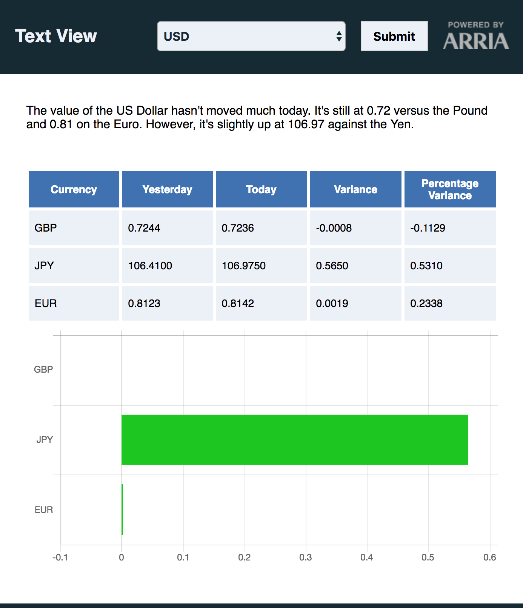
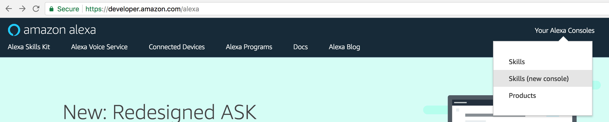
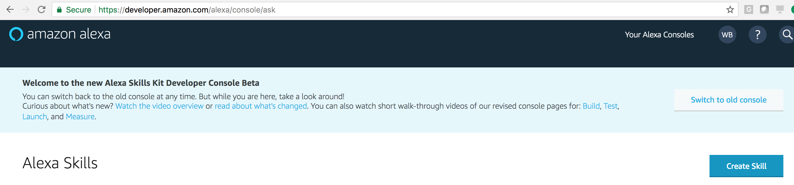
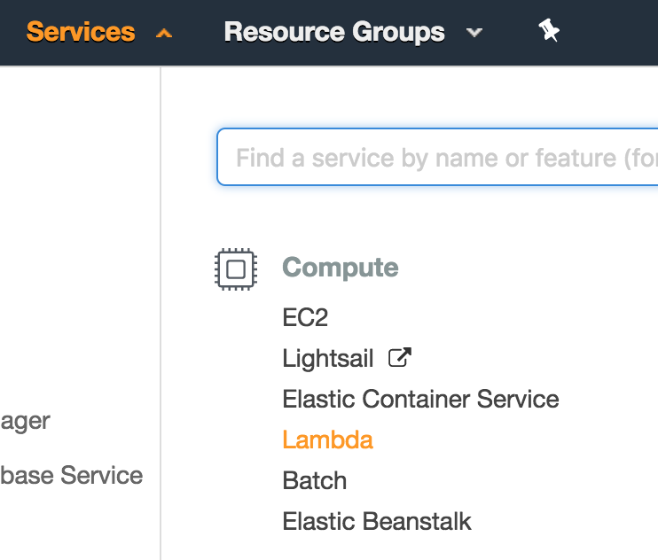
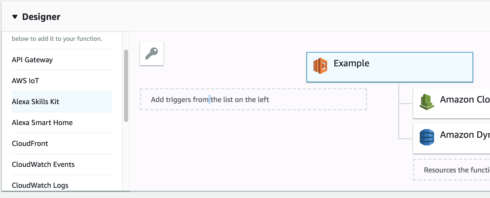
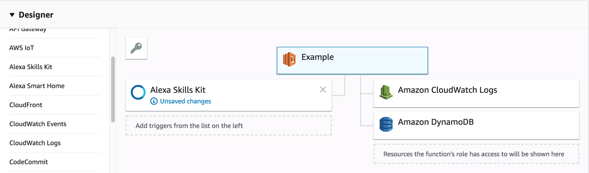

# Introduction
This repository shows how a narrative produced in [Arria NLG Studio](https://app.studio.arria.com) can be presented in different mediums. Specifically, this code shows how the same narrative is able to generate text for both Amazon Alexa and a web UI. 

The narrative itself is a simple report that describes how a currency is doing against other major currencies today. The data for this is extracted from the [Fixer.io](https://fixer.io/) api, which requires an API key. These are free if you use fewer than 1000 API calls a month.   

This project was used as part of the [Index 2018](https://developer.ibm.com/indexconf/) conference.

# Usage

## Deploying Narratives with NLG Studio

The basis of this project is an [NLG Studio](https://app.studio.arria.com) project that takes in currency data and returns a short narrative. You will need to deploy this project so that it can be accessed as a RESTful service.

To begin, log in to NLG Studio at <https://app.studio.arria.com>. If you haven't signed up yet, click **Don't Have an Account** and follow the instructions. The validation email can take a few minutes to come through.

Rather than creating the whole project from scratch, you'll import a pre-built Studio project. The file to load is in the git repository at `studio/ExchangeRates.json`. Click the **Import a Project** icon, which is next to the **New project** button. 

  

Once you have imported the project, click it to open it. 

The purpose of NLG Studio is to build an NLG application using scripts. This application can then be hosted on the Arria cloud, allowing you to post data to it and retrieve a corresponding narrative. 

To deploy your Studio application on the cloud, click **Publish** at the top right. When you see the Congratulations dialog, copy down the application's URL.

  

Your project is now hosted at the URL in the dialog. If you forget the URL (or make changes to the project) you can republish at any time. Republishing updates your existing URL.

To access that URL, you will also need an API key for authentication. You generate this key in the Settings view Selecting the **API** submenu, then click **GENERATE API KEY**. 

  

You can now call your Studio project using that URL and API key. You will need them both when you set up the back end server.  

## Configuring the Back End

To connect the NLG Studio endpoint to the data, you are going to use a simple [node.js](https://nodejs.org/en/) back end. This server has endpoints that allow both Amazon Alexa and a web application to generate output.

The server is controlled through a file called `server/config.js`, which you need to create. This file contains the URLs and API keys that are specific to your personal deployment. We have created an example file called `server/EXAMPLEconfig.js`.

From the server folder, copy the example file to config.js, e.g.
`cp EXAMPLEconfig.js config.js`

Next open this file and fill in the API key and URL for your NLG Studio project from [above](#deploying-narratives-with-nlg-studio).

To load the data you will need an API key from [Fixer.io](https://fixer.io/). Visit the site and sign up for an account (you can choose either a paid account or a free account). When you have signed up you can access your API key on the [dashboard](https://fixer.io/dashboard). Add that API key to your `config.js` file.

Once these values are added in, your server is able to generate text.
 
## Running the Web App

The quickest way to test your setup is to launch the server as a [node.js](https://nodejs.org/en/download/) webapp.

If you have node installed on your machine, run `npm install` from the server directory. This will download the dependencies for the web app. Next, launch the app from the same place using:
`node app.js`

The `app.js` script will run the webapp on `port 3000`, so you should be able to visit <http://localhost:3000/> to see how it behaves. Try pressing submit to get a narrative that looks something like this:

  

If you don't have a `config.js` file, it will declare that it "Cannot find module './config'". If you have the file but haven't added your credentials, the app will show an error message describing which service has an issue.

The app also has separate pages showing how applications can be built up using different presentation techniques:
1. [DataView](http://localhost:3000/dataView.html) just displays the raw data in a table
2. [AnalysisView](http://localhost:3000/analysisView.html) shows the analysed data in a table
3. [VisualisationView](http://localhost:3000/visualizationView.html) adds a chart representing the data
4. [TextView](http://localhost:3000/textView.html) uses our NLG Studio to explain exactly what is going on

## Launching the Alexa Skill

Using the same backed Studio project and backend server logic, we can launch an Alexa Skill that calls an AWS Lamda function. This requires an [AWS developer account](https://console.aws.amazon.com/console/home), and an [Alexa developer account](https://developer.amazon.com/alexa). You will need to switch back and forwards between the two.

### Initialising the Alexa Skill
Start by going in to the [Alexa developer account](https://developer.amazon.com/alexa) and open up the new skills console. 

  

From the console you need to select **Create Skill**.

  

Name your skill and hit **Next** (it may take a while to load). This application uses a custom interaction model, which means you will choose what the user can say. Click **Create skill**.

Skills are built around an interaction model, which controls what a user can say and what will be passed through to the server handling processing. To get you started we have provided you with a basic interaction model in the `alexa/alexaSchema.json` file. Select JSON Editor from the menu on the left. Drag the `alexa/alexaSchema.json` file on the space provided.

The only choice you need to make with this schema is what you are going to call you application. Change the `invocationName` property at the top from `arria` to your app's name. In this explanation we will assume you chose the name `currency narrator`. Alexa recommends names with 2-3 words, all lower case.

Click `Save Model` then `Build Model`. These configure the settings according to the schema. Building may take a minute or two.

The Alexa skill will need to call a server as an endpoint. This endpoint will in turn needs to know which Skills are allowed to call it. For that, go back to the [skills console main menu](https://developer.amazon.com/alexa/console/ask) and click **View Skill ID** underneath your skill name. Save the skill ID somewhere for later.

### Setting up the Lambda Function
Amazon recommends using a Lambda Function to host services for Alexa. Log in to the [AWS developer console](https://console.aws.amazon.com/console/home) and select Lambda from the list of services. 

  

Click **Create function** and use **Author from scratch**. Choose your own name for the function, and make sure the Runtime is `Node.js 6.10`. 

For the Role, choose `Create a new role from template(s)`. Name your role (e.g. alexaSkillRole) and choose `Simple Microservice permissions` in Policy templates. Click **Create function** once you are happy.

Once the function is created, you now need to configure it. First we need to link the function to Alexa. In the **Designer** pane add the `Alexa Skills Kit` trigger. 

  

In the **Configure triggers** pane, you need to tell the Lambda function to accept requests from your Alexa skill. Copy your Alexa Skill ID in to the box provided and click **Add**. If you have lost the Skill ID, go back to the [skills console main menu](https://developer.amazon.com/alexa/console/ask) and click **View Skill ID** underneath your skill name.

Now we need to configure the function code itself. In the **Designer** pane, click the name of your function to select it.

  

The **Function code** pane controls what will run when the Lambda function is executed. The Handler controls which part of your code will be called. Change the name to `alexa.handler`. This means that the `handler` function inside `alexa.js` will be used.

Now you need to upload the server code as a zip file. Zip the contents of the `server` folder. Make sure that the zip file only contains the contents, and not the `server` folder itself. In the **Function code** pane select the Code entry type of `Upload a .ZIP file` and upload your zip file.

Finally, click the **Save** button at the top of the screen. It may take some time to build.

You have now set up the Lambda function.

### Connecting Alexa to the Function
At this stage you have an Alexa skill and a Lambda function which can accept calls from that skill. However, the Alexa skill doesn't know what to do when it is invoked.

From the Lambda function console, copy the ARN at the very top of the page. This is the unique reference for your Lambda function.

Switch to the Alexa developer console and edit your Skill. From the menu on the left, select **Endpoint**. When Alexa is invoked it will parse the request and send a JSON payload to the Endpoint.

Select **AWS Lambda ARN**, then paste your Lambda function's ARN in the Default Region box.

Click **Save Endpoints** at the top of the screen. You have now set everything up for your Alexa Skill!

### Testing Your Skill
To check that everything is working, go to the **Test** tab at the top of the screen.

Each Skill starts with testing disable. Enable testing by flipping the switch at the top. This initializes the testing interface.

From here you can test your Skill by either typing queries or using your microphone.

Try using some of the following commands, supplying your invocation name as appropriate:

*Alexa, ask ___________ about the Pound*

*Alexa, ask ___________ how the Dollar is doing*

*Alexa, ask ___________ about Japanese Yen*

If you are typing, you need to make sure that you use the same capitalization as you used in your invocation name. If it can't find the invocation name it will say "Sorry, I don't know that one".

When you are happy with you Skill you can use the **Launch** tab at the top to release it, or test it with beta users.

# How It Works

# Support
For any help on how to build projects using NLG Studio please contact us at support@arrianlg.studio

This project has been built for demonstrative purposes only, it is not designed as a complete application. 
